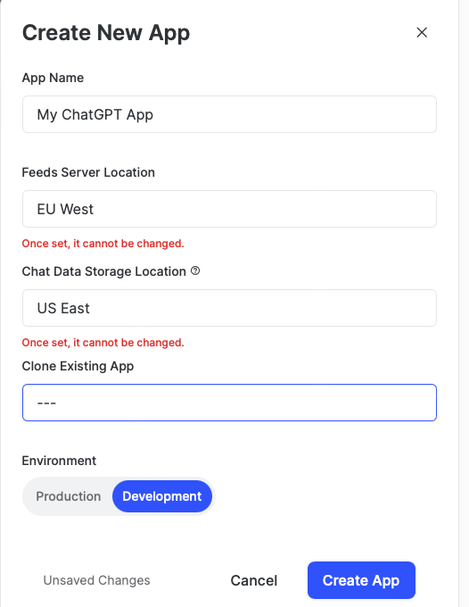
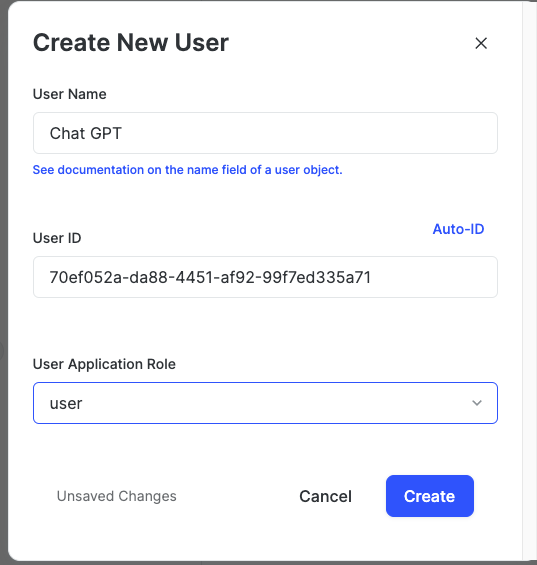
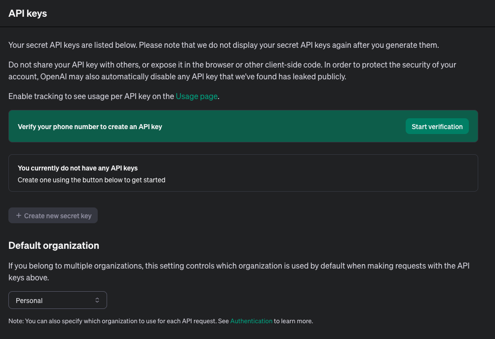
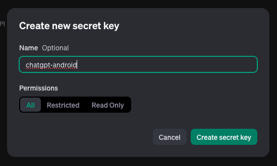
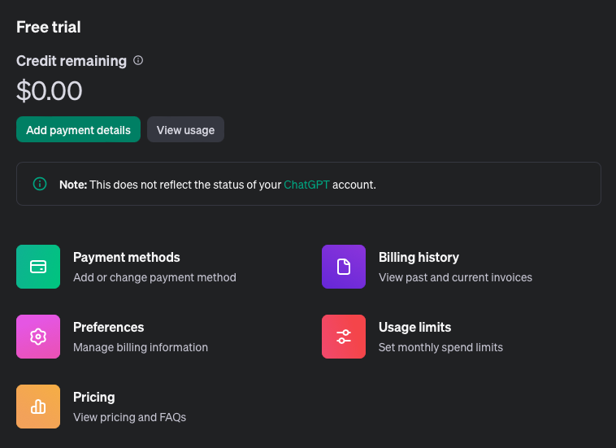
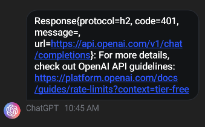

<p align="center">
  <a href="https://opensource.org/licenses/Apache-2.0"></a>
  <a href="https://android-arsenal.com/api?level=21"></a>
  <a href="https://github.com/skydoves/chatgpt-android/actions/workflows/android.yml"></a>
  <a href="https://github.com/skydoves"></a>
  <a href="https://github.com/doveletter"></a>
</p>

**ChatGPT Android** demonstrates [OpenAI's ChatGPT](https://chat.openai.com/chat) on Android with [Stream Chat SDK for Compose](https://getstream.io/chat/sdk/android/?utm_source=github&utm_medium=referral&utm_content=&utm_campaign=Jaewoong_github_2025).

The primary objective of this repository is to showcase the following:

- Demonstrating [OpenAI's chat APIs](https://platform.openai.com/docs/api-reference/chat).
- Creating comprehensive UI elements utilizing Jetpack Compose.
- Incorporating Android architecture components using Jetpack libraries such as Hilt and AppStartup.
- Executing background tasks efficiently through Kotlin Coroutines and WorkManager.
- Seamlessly integrating chat systems via the [Stream Chat SDK for Compose](https://getstream.io/chat/sdk/compose?utm_source=Github&utm_medium=Jaewoong_OSS&utm_content=Developer&utm_campaign=Github_April2024_Jaewoong_ChatGPT&utm_term=DevRelOss) to facilitate real-time event handling.

## 📷 Previews

<p align="center">


</br>
</p>

<a href="https://getstream.io/chat/sdk/compose?utm_source=Github&utm_medium=Jaewoong_OSS&utm_content=Developer&utm_campaign=Github_April2024_Jaewoong_ChatGPT&utm_term=DevRelOss">

</a>

## 🛥 Stream Chat & Video SDKs
**ChatGPT Android** is built with __[Stream Chat SDK for Compose](https://getstream.io/chat/sdk/android/?utm_source=github&utm_medium=referral&utm_content=&utm_campaign=Jaewoong_github_2025)__ to implement messaging systems. If you’re interested in adding powerful In-App Messaging or real-time Video Chat to your app, check out the __[Android Chat Messaging Tutorial](https://getstream.io/tutorials/android-chat?utm_source=github&utm_medium=referral&utm_content=&utm_campaign=Jaewoong_github_2025)__ or __[Android Video Call Tutorial](https://getstream.io/video/docs/android/tutorials/video-calling?utm_source=github&utm_medium=referral&utm_content=&utm_campaign=Jaewoong_github_2025)__ !

- [Stream Chat SDK for Android on GitHub](https://github.com/getStream/stream-chat-android)
- [Android Samples for Stream Chat SDK on GitHub](https://github.com/getStream/android-samples)
- [Stream Chat Compose UI Componenets Guidelines](https://getstream.io/chat/docs/sdk/android/compose/overview/)

If you're interested in building a real-time meeting room with video/audio calling, audio room, or livestreaming, check out the references below:

- [Stream Video SDK for Android on GitHub](https://github.com/getstream/stream-video-android)
- [Video Call Tutorial](https://getstream.io/video/docs/android/tutorials/video-calling?utm_source=github&utm_medium=referral&utm_content=&utm_campaign=Jaewoong_github_2025) / [Audio Room Tutorial](https://getstream.io/video/docs/android/tutorials/audio-room?utm_source=github&utm_medium=referral&utm_content=&utm_campaign=Jaewoong_github_2025) / [Livestream Tutorial](https://getstream.io/video/docs/android/tutorials/livestream?utm_source=github&utm_medium=referral&utm_content=&utm_campaign=Jaewoong_github_2025)

## 💻 How to build the project?

For proper project setup, it's essential to follow the instructions below. In most cases, you can complete all configuration steps within 10 to 20 minutes:

1. Go to the __[Stream login page](https://getstream.io/try-for-free?utm_source=github&utm_medium=referral&utm_content=&utm_campaign=Jaewoong_github_2025)__.

2. If you have your GitHub or Google account, click the **Continue with GitHub** or **Continue with Google** button and you can sign up within a couple of seconds. 


3. Go to the __[Dashboard](https://dashboard.getstream.io?utm_source=github&utm_medium=referral&utm_content=&utm_campaign=Jaewoong_github_2025)__ and click the **Create App** button like the below.


4. Fill in the blanks like the below and click the **Create App** button.



5. You will see the **Key** like the figure below and then copy it.


6. Create a new file named **secrets.properties** on the root directory of this Android project, and add the key to the `secrets.properties` file like the below:


```gradle
STREAM_API_KEY=..
```

7. Go to your __[Dashboard](https://dashboard.getstream.io?utm_source=github&utm_medium=referral&utm_content=&utm_campaign=Jaewoong_github_2025)__ again and click your App.

9. In the **Overview** menu, you can find the **Authentication** category by scrolling to the middle of the page.
10. Switch on the **Disable Auth Checks** option and click the **Submit** button like the figure below.


11. Click the **Explorer** tab on the left side menu.

12. Click **users** -> **Create New User** button sequentially and add fill in the user like the below:



- User Name: `Chat GPT`
- User ID: `70ef052a-da88-4451-af92-99f7ed335a71`

13. Now, it's time to set up the OpenAI API key. Go to __[OpenAI API Dashboard](https://platform.openai.com/api-keys)__, login with your Google account and click **Start verification** to verify your phone number to create an API key.



14. After verifying your phone number, click the **Create new secret key** on the page like the image below and create your API key:



15. Copy and paste your API key to the `secrets.properties` file as named `GPT_API_KEY` under the `STREAM_API_KEY` field:


```gradle
GPT_API_KEY=..
```

16. Unlock Rate limits for OpenAI APIs

As per the guidelines outlined in their [Rate limits](https://platform.openai.com/account/limits) documentation, access to the free tier of the API is __granted after a minimum expenditure of $5 since the creation of your account__. That means, you should register your payment method to the OpenAI and purchase initial credits. 


So you should go to the [OpenAI Billings](https://platform.openai.com/account/billing/overview) and click the **Add payment details** button like the image below:



17. Once you've added your payment deatils, you'll able to see the **Add to creadit balance** button like the image below:


Next, click the **Add to credit balance** button to purchase the initial credit. As you've discovered in the previous step, the minimum credit starts from $5. Therefore, if you only intend to utilize the API limits for testing or building a side project, you can opt for the minimum pricing. Also, not that it's advisable to disable the automatic recharge option to avoid unexpected charges.


18. Once you've completed all those steps above, now build, run and enjoy your the project!

## ⚙️ Troubleshooting

You can typically find the reasons behind your error code by referring to the [OpenAI Error code documentation](https://platform.openai.com/docs/guides/error-codes).

### 401 Error

If you encounter 401 errors while chatting with ChatGPT app, as shown in the image below, it's crucial to verify the correctness of your OpenAI API key. Ensure that there are no typos in your API key and that it has been correctly copied and pasted into the `secrets.properties` file, as outlined in the guidelines above.



### 429 Error

If you encounter this error from the outset, it's likely that your rate limits do not meet the requirements. Please revisit step 16 in the guidelines above for further instructions.

## 🛠 Tech Stack & Open Source Libraries
- Minimum SDK level 21.
- 100% [Jetpack Compose](https://developer.android.com/jetpack/compose) based + [Coroutines](https://github.com/Kotlin/kotlinx.coroutines) + [Flow](https://kotlin.github.io/kotlinx.coroutines/kotlinx-coroutines-core/kotlinx.coroutines.flow/) for asynchronous and cold streams.
- [Compose Chat SDK for Messaging](https://getstream.io/chat/sdk/compose?utm_source=github&utm_medium=referral&utm_content=&utm_campaign=Jaewoong_github_2025): The Jetpack Compose Chat Messaging SDK is built on a low-level chat client and provides modular, customizable Compose UI components that you can easily drop into your app.
- [OpenAI Chat API](https://platform.openai.com/docs/api-reference/chat): Given a list of messages comprising a conversation, the model will return a response.
- Jetpack
  - Compose: Android’s modern toolkit for building native UI.
  - ViewModel: UI related data holder and lifecycle aware.
  - App Startup: Provides a straightforward, performant way to initialize components at application startup.
  - Navigation: For navigating screens and [Hilt Navigation Compose](https://developer.android.com/jetpack/compose/libraries#hilt) for injecting dependencies.
  - Room: Constructs Database by providing an abstraction layer over SQLite to allow fluent database access.
  - [Hilt](https://dagger.dev/hilt/): Dependency Injection.
  - [WorkManager](https://developer.android.com/topic/libraries/architecture/workmanager): To achieve background processing with scheduling.
- [Landscapist Glide](https://github.com/skydoves/landscapist#glide), [animation](https://github.com/skydoves/landscapist#animation), [placeholder](https://github.com/skydoves/landscapist#placeholder): Jetpack Compose image loading library that fetches and displays network images with Glide, Coil, and Fresco.
- [Retrofit2 & OkHttp3](https://github.com/square/retrofit): Construct the REST APIs and paging network data.
- [Sandwich](https://github.com/skydoves/Sandwich): Construct a lightweight and modern response interface to handle network payload for Android.
- [Moshi](https://github.com/square/moshi/): A modern JSON library for Kotlin and Java.
- [ksp](https://github.com/google/ksp): Kotlin Symbol Processing API.
- [Balloon](https://github.com/skydoves/balloon): Modernized and sophisticated tooltips, fully customizable with an arrow and animations for Android.
- [viewmodel-lifecycle](https://github.com/skydoves/viewmodel-lifecycle): ViewModel Lifecycle allows you to track and observe Jetpack's ViewModel lifecycle changes.
- [StreamLog](https://github.com/GetStream/stream-log): A lightweight and extensible logger library for Kotlin and Android.
- [Baseline Profiles](https://medium.com/proandroiddev/improve-your-android-app-performance-with-baseline-profiles-297f388082e6): To improve app performance by including a list of classes and methods specifications in your APK that can be used by Android Runtime.

## 🏛️ Architecture

**ChatGPT Android** follows the [Google's official architecture guidance](https://developer.android.com/topic/architecture).


**ChatGPT Android** was built with [Guide to app architecture](https://developer.android.com/topic/architecture), so it would be a great sample to show how the architecture works in real-world projects.<br>

The overall architecture is composed of two layers; UI Layer and the data layer. Each layer has dedicated components and they each have different responsibilities.
The arrow means the component has a dependency on the target component following its direction.

### Architecture Overview


Each layer has different responsibilities below. Basically, they follow [unidirectional event/data flow](https://developer.android.com/topic/architecture/ui-layer#udf).

### UI Layer


The UI Layer consists of UI elements like buttons, menus, tabs that could interact with users and [ViewModel](https://developer.android.com/topic/libraries/architecture/viewmodel) that holds app states and restores data when configuration changes.

### Data Layer


The data Layer consists of repositories, which include business logic, such as querying data from the local database and requesting remote data from the network. It is implemented as an offline-first source of business logic and follows the [single source of truth](https://en.wikipedia.org/wiki/Single_source_of_truth) principle.<br>

For more information about the overall architecture, check out **[Build a Real-Time WhatsApp Clone With Jetpack Compose](https://getstream.io/blog/build-whatsapp-clone/)**.

## Modularization


**ChatGPT Android** adopted modularization strategies below:

- **Reusability**: Modulizing reusable codes properly enable opportunities for code sharing and limits code accessibility in other modules at the same time.

- **Parallel Building**: Each module can be run in parallel and it reduces the build time.

- **Decentralized focusing**: Each developer team can assign their dedicated module and they can focus on their own modules.


## 💯 MAD Score


## 🤝 Contribution

Most of the features are not completed except the chat feature, so anyone can contribute and improve this project following the [Contributing Guideline](https://github.com/skydoves/chatgpt-android/blob/main/CONTRIBUTING.md).

## Find this repository useful? 💙
Support it by joining __[stargazers](https://github.com/skydoves/chatgpt-android/stargazers)__ for this repository. :star: <br>
Also, __[follow me](https://github.com/skydoves)__ on GitHub for my next creations! 🤩

# License
```xml
Designed and developed by 2022 skydoves (Jaewoong Eum)

Licensed under the Apache License, Version 2.0 (the "License");
you may not use this file except in compliance with the License.
You may obtain a copy of the License at

   http://www.apache.org/licenses/LICENSE-2.0

Unless required by applicable law or agreed to in writing, software
distributed under the License is distributed on an "AS IS" BASIS,
WITHOUT WARRANTIES OR CONDITIONS OF ANY KIND, either express or implied.
See the License for the specific language governing permissions and
limitations under the License.
```
